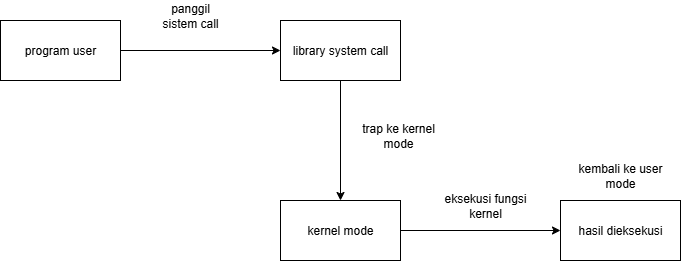

# Laporan Praktikum Minggu [2]
Topik: "Arsitektur Sistem Operasi dan Kernel"

---

## Identitas
- **Nama**  : Rivan Ahmad Ardiansyah
- **NIM**   : 220202715
- **Kelas** : 1 IKRB

---

## Tujuan
1. Menjelaskan konsep dan fungsi system call dalam sistem operasi.
2. Mengidentifikasi jenis-jenis system call dan fungsinya.
3. Mengamati alur perpindahan mode user ke kernel saat system call terjadi.
4. Menggunakan perintah Linux untuk menampilkan dan menganalisis system call.

---

## Dasar Teori
Mahasiswa akan melakukan eksplorasi terhadap:

1. Jenis-jenis system call yang umum digunakan (file, process, device, communication).
2. Alur eksekusi system call dari mode user menuju mode kernel.
3. Cara melihat daftar system call yang aktif di sistem Linux.

---

## Langkah Praktikum
1. Setup Environment

Gunakan Linux (Ubuntu/WSL).
Pastikan perintah strace dan man sudah terinstal.
Konfigurasikan Git (jika belum dilakukan di minggu sebelumnya).

2. Eksperimen 1 – Analisis System Call Jalankan perintah berikut:

strace ls
Catat 5–10 system call pertama yang muncul dan jelaskan fungsinya.
Simpan hasil analisis ke results/syscall_ls.txt.

3. Eksperimen 2 – Menelusuri System Call File I/O Jalankan:

strace -e trace=open,read,write,close cat /etc/passwd
Analisis bagaimana file dibuka, dibaca, dan ditutup oleh kernel.

4. Eksperimen 3 – Mode User vs Kernel Jalankan:

dmesg | tail -n 10
Amati log kernel yang muncul. Apa bedanya output ini dengan output dari program biasa?

5. Diagram Alur System Call

Buat diagram yang menggambarkan alur eksekusi system call dari program user hingga kernel dan kembali lagi ke user mode.
Gunakan draw.io / mermaid.
Simpan di:
praktikum/week2-syscall-structure/screenshots/syscall-diagram.png

6. Commit & Push

git add .

git commit -m "Minggu 2 - Struktur System Call dan Kernel Interaction"

git push origin main

---

## Kode / Perintah
Tuliskan potongan kode atau perintah utama:
```bash
strace ls
strace -e trace=open,read,write,close cat /etc/passwd
dmesg | tail -n 10
```

---

## Hasil Eksekusi
Sertakan screenshot hasil percobaan atau diagram:


---

## Analisis
- Jelaskan makna hasil percobaan.  
- Hubungkan hasil dengan teori (fungsi kernel, system call, arsitektur OS).  
- Apa perbedaan hasil di lingkungan OS berbeda (Linux vs Windows)?  

---

## Kesimpulan
1. System call adalah jembatan yang sangat terstruktur, yang memungkinkan aplikasi meminta layanan penting.
2. Jembatan ini menjaga isolasi antara mode pengguna dan mode kernel, memastikan stabilitas dan keamanan sistem operasi secara keseluruhan. 
3. Fungsi kernel bertindak sebagai penguasa tunggal yang mengelola semua sumber daya fisik dan logis, dan System Call adalah gerbang utamanya.

---

## Quiz
1. [Apa fungsi utama system call dalam sistem operasi?]  
   **Jawaban: System Call adalah mekanisme yang menyediakan antarmuka antara suatu proses dan sistem operasi. Ini adalah metode terprogram di mana program komputer meminta layanan dari kernel SO.**  
2. [Sebutkan 4 kategori system call yang umum digunakan.]  
   **Jawaban: Pengendalian proses, Manajemen file, Manajemen perangkat, Pemeliharaan Informasi, komunikasi**  
3. [Mengapa system call tidak bisa dipanggil langsung oleh user program?]  
   **Jawaban:  System call tidak bisa dipanggil langsung untuk melindungi Kernel OS dari akses ilegal program pengguna, untuk menjaga keamanan dan stabilitas sistem melalui mekanisme Trap.**  

---

## Refleksi Diri
Tuliskan secara singkat:
- Apa bagian yang paling menantang minggu ini?  
(bagian yang menantang adalah saat menginstall wsl ubuntu karena diawal selalu for close keluar saat mau diketik)
- Bagaimana cara Anda mengatasinya? 
(dengan cara melakukan perintah melalui Windows PowerCell) 

---

**Credit:**  
_Template laporan praktikum Sistem Operasi (SO-202501) – Universitas Putra Bangsa_
